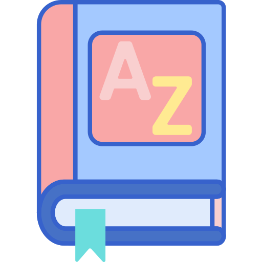

# Dictionary.js

  

 

> This app makes life easy for all users by helping them to get the defination of words they required with audio 

## ⚙️ Detailed Functionality
* From this web application any one can search words which they requried 
* Users can get the defination of each word  they search
* Users can get  info like defination,audio,examples,prononusation etc..
 
## 🚀 Tech and Tools Used

* HTML,CSS and javascript
* VS code
* dictionaryapi

## 📸 Screenshots

link:https://jaydeep-shelake.github.io/Dictionary.js/
